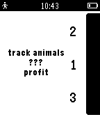

# data-logging-demo

This example app consists of a three app projects for Pebble, Android and iOS, 
and uses the 
[Data Logging API](/https://developer.getpebble.com/docs/c/group___data_logging.html) 
to count the number of times each of a number of sea creaters has been
'spotted'. This action is triggered by pressing buttons in the Pebble app and
then transmitted to the appropriate companion app.
