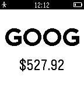

# quotes

This app shows how to use the PebbleKit JS APIs to fetch price quotes from the
internet and display them on Pebble. Use the buttons to choose your stock symbol
(for example, GOOG for Google) and check for the appropriate price value.