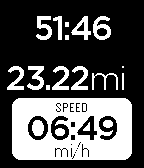

# sports-demo

Similar to the `golf-demo` example, each of these Android and iOS projects
demonstrate how to launch and push data and statistics to the Sports API sport
watchapp. This app has fields for time, pace, speed, distance that is ideal for
running apps. The watchapp is built-in to the Pebble firmware and so is not
required to be written by the developer.