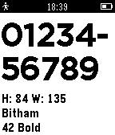

# app_font_browser

This example show how to load and display all the Pebble built-in system fonts. 

It also uses the [`Clicks`](https://developer.getpebble.com/docs/c/group___clicks.html) API to allow the user to cycle through each font in both
directions.
