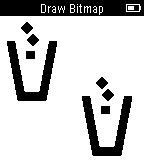

# feature_draw_bitmap

This example shows how to draw a bitmap.

Check out our [guide](https://developer.getpebble.com/guides/pebble-apps/display-and-animations/resources/) on how to use app resources.
