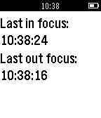

# feature_focus_handler

This example shows how to use the [`AppFocusService`](https://developer.getpebble.com/docs/c/group___app_focus_service.html) to handle app focus.

Check out our [guide](https://developer.getpebble.com/guides/pebble-apps/app-events/app-interruptions/) on how to manage app interruptions.
